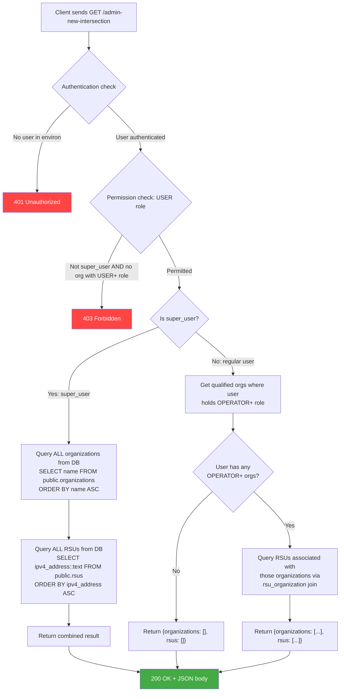
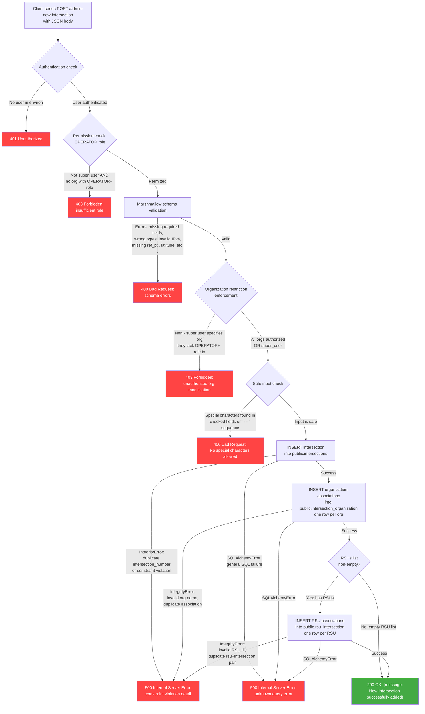

# Admin New Intersection API Specification

## Overview

The `AdminNewIntersection` resource (`/admin-new-intersection`) provides two operations for managing intersection creation in the CV Manager system:

- **GET** — Retrieve the list of organizations and RSUs the authenticated user is allowed to associate with a new intersection.
- **POST** — Create a new intersection record with associated organizations and RSUs.

**Route registration**: Conditional on the `ENABLE_INTERSECTION_FEATURES` feature flag in `services/api/src/main.py`.

**Source**: `services/api/src/admin_new_intersection.py`
**Tests**: `services/api/tests/src/test_admin_new_intersection.py`
**Test data**: `services/api/tests/data/admin_new_intersection_data.py`

---

## Database Schema Context

Three tables are involved:

| Table                              | Key Columns                                                                                                                                                                                | Purpose                                     |
|------------------------------------|--------------------------------------------------------------------------------------------------------------------------------------------------------------------------------------------|---------------------------------------------|
| `public.intersections`             | `intersection_id` (PK, serial), `intersection_number` (unique), `ref_pt` (PostGIS POINT), `bbox` (PostGIS POLYGON, nullable), `intersection_name` (nullable), `origin_ip` (inet, nullable) | Stores intersection geometry and metadata   |
| `public.intersection_organization` | `intersection_organization_id` (PK), `intersection_id` (FK), `organization_id` (FK)                                                                                                        | Associates intersections with organizations |
| `public.rsu_intersection`          | `rsu_intersection_id` (PK), `rsu_id` (FK), `intersection_id` (FK), UNIQUE(`rsu_id`, `intersection_id`)                                                                                     | Associates RSUs with intersections          |

---

## Authentication & Authorization

Both endpoints use the `@require_permission` decorator from `common.auth_tools`. This decorator:

1. Reads the authenticated user from `request.environ["user"]` (injected by WSGI middleware after Keycloak token introspection).
2. Checks that `user_info` exists (else 401 Unauthorized).
3. Computes the user's `qualified_orgs` — organizations where the user holds at least the required role.
4. Super users (`super_user == "1"`) bypass role checks and are always permitted.
5. Non-super users must hold the required role in at least one organization (else 403 Forbidden).
6. Passes a `PermissionResult` (containing `user`, `qualified_orgs`, `allowed`, `message`) into the endpoint handler.

### Role Hierarchy

`User < Operator < Admin` — a user with Operator role satisfies a User-level check, and so on.

---

## GET `/admin-new-intersection`

### Purpose

Returns the set of organizations and RSU IP addresses that the authenticated user is permitted to assign when creating a new intersection. This populates dropdown/selection UI components.

### Required Role

`USER` (minimum)

### Response Shape

```json
{
  "organizations": [
    "Org A",
    "Org B"
  ],
  "rsus": [
    "192.168.1.1",
    "192.168.1.2"
  ]
}
```

### Behavior by User Type

| User Type      | Organizations Returned                                                              | RSUs Returned                                                                     |
|----------------|-------------------------------------------------------------------------------------|-----------------------------------------------------------------------------------|
| Super user     | All organizations (`SELECT name FROM public.organizations ORDER BY name ASC`)       | All RSUs (`SELECT ipv4_address::text FROM public.rsus ORDER BY ipv4_address ASC`) |
| Non-super user | Only organizations where user holds `OPERATOR`+ role (via `get_qualified_org_list`) | RSUs associated with those organizations (via `get_rsu_set_for_org`)              |

> **Note**: The GET endpoint requires `USER` role for access, but the organization filtering within `get_allowed_selections` uses `OPERATOR` as the threshold. This means a user with only `USER` role
> in all organizations will get an empty result for organizations and RSUs, even though they pass the access gate.

### Data Flow Diagram



---

## POST `/admin-new-intersection`

### Purpose

Creates a new intersection record in the database along with its organization and RSU associations.

### Required Role

`OPERATOR` (minimum)

### Request Schema (Marshmallow validation)

| Field               | Type                                                                   | Required | Notes                                                |
|---------------------|------------------------------------------------------------------------|----------|------------------------------------------------------|
| `intersection_id`   | Integer                                                                | Yes      | Stored as `intersection_number` in DB                |
| `ref_pt`            | Object: `{latitude: Decimal, longitude: Decimal}`                      | Yes      | Converted to PostGIS POINT geometry                  |
| `organizations`     | List of Strings                                                        | Yes      | Min length 1. Organization names to associate.       |
| `rsus`              | List of IPv4 strings                                                   | Yes      | RSU IP addresses to associate. May be empty `[]`.    |
| `bbox`              | Object: `{latitude1, longitude1, latitude2, longitude2}` (all Decimal) | No       | Converted to PostGIS envelope (bounding box polygon) |
| `intersection_name` | String                                                                 | No       | Human-readable name for the intersection             |
| `origin_ip`         | IPv4                                                                   | No       | Origin IP address                                    |

### Example Request Body

```json
{
  "intersection_id": 123,
  "ref_pt": {
    "latitude": 40.123,
    "longitude": -105.456
  },
  "organizations": [
    "Org A"
  ],
  "rsus": [
    "192.168.1.2"
  ],
  "bbox": {
    "latitude1": 40.111,
    "longitude1": -105.444,
    "latitude2": 40.133,
    "longitude2": -105.466
  },
  "intersection_name": "Main St & 1st Ave",
  "origin_ip": "10.0.0.1"
}
```

### Success Response

```json
{
  "message": "New Intersection successfully added"
}
```

### Validation Pipeline

The POST handler applies validations in this order:

1. **Marshmallow schema validation** — type checking, required fields, IPv4 format, nested object structure.
2. **Organization restriction enforcement** — non-super users may only specify organizations they hold `OPERATOR`+ role in.
3. **Safe input check** — rejects special characters that could indicate SQL injection. Checked fields: all string/numeric fields *except* `origin_ip`, `rsus`, `rsus_to_add`, `rsus_to_remove`,
   `latitude`, `longitude`, `latitude1`, `longitude1`, `latitude2`, `longitude2`. Forbidden characters: `` !"#$%'()*+,./:;<=>?@[\]^`{|}~ ``. The sequence `--` is also forbidden. The `&` character is
   explicitly **allowed** (per a 2025-07-02 code note for intersection names).
4. **Database writes** — three sequential INSERT statements (intersection, then org associations, then RSU associations).

### Database Write Sequence

1. **INSERT intersection**: Inserts into `public.intersections` with mandatory `intersection_number` and `ref_pt`, plus optional `bbox`, `intersection_name`, `origin_ip`.
2. **INSERT organization associations**: Inserts one row per organization into `public.intersection_organization`, resolving `intersection_id` and `organization_id` via subqueries.
3. **INSERT RSU associations** (conditional): Only if `rsus` list is non-empty. Inserts one row per RSU into `public.rsu_intersection`, resolving `rsu_id` and `intersection_id` via subqueries.

All three writes use `pgquery.write_db()` which commits after each call. There is **no transaction wrapping all three** — a failure on step 2 or 3 leaves the intersection row from step 1 committed (
partial write).

### Error Responses

| Condition                                                        | HTTP Status | Error Source                                      |
|------------------------------------------------------------------|-------------|---------------------------------------------------|
| Not authenticated                                                | 401         | `@require_permission` decorator                   |
| Insufficient role (no OPERATOR+ org)                             | 403         | `@require_permission` decorator                   |
| Schema validation failure (missing/wrong type fields)            | 400         | `abort(400, str(errors))`                         |
| Unauthorized organization in request                             | 403         | `enforce_organization_restrictions`               |
| Unsafe characters detected in input                              | 400         | `check_safe_input` via `BadRequest`               |
| Duplicate `intersection_number` or other DB constraint violation | 500         | `IntegrityError` handler → `InternalServerError`  |
| General SQL error                                                | 500         | `SQLAlchemyError` handler → `InternalServerError` |

### Data Flow Diagram



### Safe Input Check Detail

```mermaid
flowchart TD
    A["check_safe_input(intersection_spec)"] --> B[Iterate over all key-value pairs]
    B --> C{Value is a dict?}
    C -->|Yes| D[Recurse into nested dict]
    D -->|Recursive call returns false| FAIL[Return false]
    D -->|Recursive call returns true| B
    C -->|No| E{Value is a list?}
    E -->|Yes| F[Check each list element<br/>by wrapping in dict and recursing]
    F -->|Any element fails| FAIL
    F -->|All elements pass| B
    E -->|No: scalar value| G{Key in unchecked_fields?<br/>origin_ip, rsus, rsus_to_add,<br/>rsus_to_remove, latitude, longitude,<br/>latitude1, longitude1, latitude2, longitude2}
    G -->|Yes| B
    G -->|No| H{Value is None?}
    H -->|Yes| B
    H -->|No| I{"Contains any of:<br/>!\"#$%'()*+,./:;&lt;&gt;=?@[\\]^`{|}~"}

    I -->|Yes| FAIL
    I -->|No| K{"Contains '-- ' sequence? " }
K -->|Yes| FAIL
K -->|No| B

B -->|All pairs checked| PASS[Return true]

style FAIL fill:#f44,color:#fff
style PASS fill:#4a4,color:#fff
```

---

## Existing Test Coverage

The test suite in `test_admin_new_intersection.py` covers:

| Test                              | What it verifies                                                        |
|-----------------------------------|-------------------------------------------------------------------------|
| `test_request_options`            | OPTIONS returns 204 with correct CORS headers                           |
| `test_entry_get`                  | GET delegates to `get_allowed_selections` and returns 200               |
| `test_entry_post`                 | POST with valid JSON delegates to `add_intersection` and returns 200    |
| `test_entry_post_schema_bad_json` | POST with invalid JSON (missing `ref_pt.latitude`) raises HTTPException |
| `test_check_safe_input`           | Valid input passes the safe input check                                 |
| `test_check_safe_input_bad`       | Input containing `--` sequence fails the safe input check               |

### Notable Test Gaps that must be covered during migration

- No tests for `add_intersection()` itself (DB write logic, IntegrityError handling, SQLAlchemyError handling)
- No tests for `get_allowed_selections()` (super user vs. regular user paths)
- No tests for organization restriction enforcement within POST
- No tests for the conditional inclusion of optional fields (`bbox`, `intersection_name`, `origin_ip`)
- No tests for the edge case of an empty `rsus` list (RSU insert is skipped)
- No tests for special character rejection beyond the `--` case

---

## Key Observations for Migration

1. **No transaction boundary**: The three INSERT statements (intersection, org associations, RSU associations) are committed independently. A failure on step 2 or 3 leaves orphaned data from prior
   steps. Consider wrapping these in a single transaction in the new implementation.

2. **SQL injection mitigation via character filtering**: The `check_safe_input` function acts as a manual SQL injection guard because the queries use **string interpolation** (f-strings), not
   parameterized queries. The new implementation should use parameterized queries, which would eliminate the need for this function entirely.

3. **Subquery-based FK resolution**: Organization and RSU associations are inserted using inline subqueries (`SELECT organization_id FROM ... WHERE name = '...'`). If an org name or RSU IP doesn't
   match a DB record, the subquery returns NULL and the INSERT silently fails or raises an IntegrityError. The new implementation could validate existence upfront and return clear 404/400 errors.

4. **CORS headers are manually managed**: Each resource class defines its own `options_headers` and `headers` dicts. A framework with built-in CORS middleware would simplify this.

5. **Feature flag gating**: The route is only registered when `ENABLE_INTERSECTION_FEATURES` is true. Replicate this conditional registration in the new framework.

6. The Organization must be required. 
