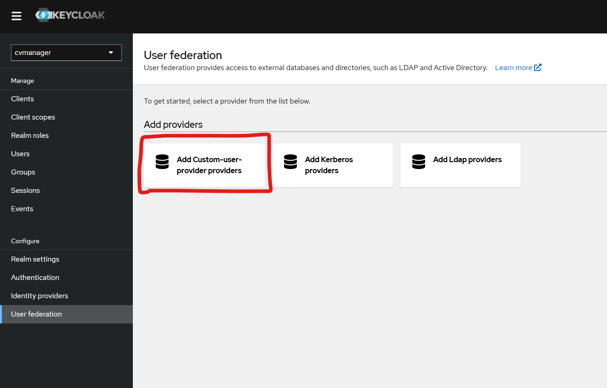
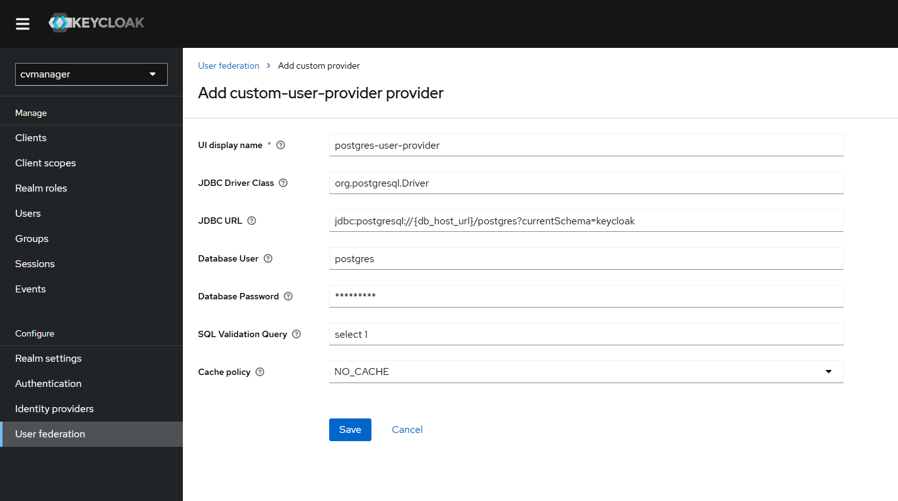

# Keycloak Configuration

## Realm Configuration

The `realm.json` file included in this project initializes Keycloak with a sample configuration for the `cvmanager` realm. This includes creating a test user with the below credentials:

- **Email:** `test@gmail.com`
- **Password:** `tester`

## Keycloak Theme

A sample keycloak theme is provided in the `sample_theme.jar` file. This is a sample theme generated using [Keycloakify](https://github.com/CDOT-CV/keycloakify-starter), to use a custom theme put a generated .jar file in this directory and then update the `KEYCLOAK_LOGIN_THEME_NAME` with the name of the new .jar file.

## Migration Steps

This section describes the steps required to add this custom user provider to an existing cvmanager deployment. If followed correctly, there will be no action required by users (other than possibly having local users re-set their credentials, more on that later), and no user data will be lost.

1. Deploy the updated keycloak image
   - This will add the custom-user-provider and custom-protocol-mappers to keycloak, but will not enable them yet (assuming the postgres volume is persisted)
2. Update the postgres public.users table definition by running the following script in postgres: [user_provider_table_update.sql](../sql_scripts/update_scripts/user_provider_table_update.sql)
3. In the Keycloak admin console, delete all of the google-idp provided users
   - For google-authenticated users, there is no necessary information stored here
4. For local users (authenticated by keycloak itself), there are 2 options:
   - a. Record each user's email, and delete each of the users. This will require resetting their credentials at the end
   - b. Leave the users intact - this will create duplicate keycloak accounts, but keycloak seems to handle this just fine
5. In the Keycloak admin console, under the User federation tab, add the custom-user-provider provider
   - 
   - Enter the following data:
     | Property | Value |
     |---------------------|------------------------------|
     | UI display name | postgres-user-provider |
     | JDBC Driver Class | org.postgresql.Driver |
     | JDBC URL (include port if required) | jdbc:postgresql://_{db_host_url}_/postgres?currentSchema=keycloak |
     | Database User | _{database username}_ |
     | Database Password | _{database password}_ |
     | SQL Validation Query | select 1 |
     | Cache policy | NO_CACHE |
   - 
   - Confirm functionality by searching the Users (enter \*)
6. Add the custom token mapper
   - In the Keycloak admin console, under the Clients tab, select the cvmanager_gui client
   - Under the Client scopes tab, select the cvmanager_gui_dedicated client scope
   - Select "Configure a new mapper"
   - Select "Custom Token Mapper"
   - Enter the following data:
     | Property | Value |
     |---------------------|------------------------------|
     | Mapper Type | Custom Token Mapper |
     | Name | postgres-role-token-mapper |
     | Token Claim Name | postgres_role_token_claim |
     | Add to ID token | true |
     | Add to access token | true |
     | Add to userinfo | false |
   - 
7. Modify the google IDP authentication flow
   - In the Authentication tab, select the "first broker login" flow
   - under the Action tab (top left), select "Duplicate". Enter the following information:
     | Property | Value |
     |---------------------|------------------------------|
     | Name | Google duplicate first broker login |
     | Description | Actions taken after first broker login with identity provider account, which is not yet linked to any Keycloak account. This flow is modified to remove authentication from the account linking process, as postgres-provided users have no credentials set |
   - hit "Duplicate"
   - Remove all steps under "Google duplicate first broker login Handle Existing Account"
   - On "Google duplicate first broker login Handle Existing Account", hit the + and Add Step
   - Select "Automatically set existing user" and Add
   - Set the "Automatically set existing user" Requirement dropdown to "Required"
   - Confirm that your Google duplicate first broker login flow looks like the image below:
   - 
   - Navigate to the Identity Providers tab, select "google"
   - Under Advanced Settings, change the "First login flow" to "Google duplicate first broker login"
8. If you deleted keycloak local users, re-set their passwords manually
   - If you have email sending configured, send them a "Update Password" reset action under the user's credentials
   - Or, manually set new temporary passwords and manually send them to your users
9. Complete
   - Now, users can login through the google IDP, and their newly-created keycloak identities will be automatically linked to their existing postgres information!
   - In the future, consider reverting the changes to the first broker login authentication flow

## Updating the Realm.json

To regenerate the ream.json from an active keycloak instance, execute the following commands within the keycloak container:

```sh
cd /opt/keycloak
./bin/kc.sh export --file=realm.json
```

Then from the source machine:

```sh
docker cp jpo-cvmanager-cvmanager_keycloak-1:/opt/keycloak/realm.json ./resources/keycloak/realm-updated.json
```

### Updating a generated realm.json

The realm.json used by this project is slightly modified from a keycloak generated realm.json. These modifications include:

1. Update cvmanager-api client secret wildcard

```json
{
    "id": "d35340f6-db3c-42fa-8596-6184649ce624",
    "clientId": "cvmanager-api",
    ...
    "secret": "${KEYCLOAK_API_CLIENT_SECRET_KEY}",
}
```

2. Update cvmanager-gui client redirect URI and web origin wildcards

```json
{
    "id": "62094482-22c8-4982-abd0-9e033b36635d",
    "clientId": "cvmanager-gui",
    ...
    "redirectUris": [
        "http://localhost:3000/*",
        "http://localhost:3001/*",
        "http://localhost:3002/*",
        "http://localhost/*",
        "${WEBAPP_ENDPOINT}/*"
    ],
    "webOrigins": [
        "http://localhost:3000",
        "http://localhost:3001",
        "http://localhost:3002",
        "http://localhost",
        "${WEBAPP_ENDPOINT}"
    ],
}
```

3. Update sa_count_metric client secret wildcard

```json
{
    "id": "e327e402-24ce-41d0-b53a-a06738e386ec",
    "clientId": "sa_count_metric",
    ...
    "secret": "${KEYCLOAK_SA_COUNT_METRIC_CLIENT_SECRET_KEY}",
}
```

4. Update sa_count_metric client secret wildcard

```json
{
    "id": "679891a3-6396-41a7-85d4-7e654a1bdcaa",
    "clientId": "sa_cvmanager_python_api",
    ...
    "secret": "${KEYCLOAK_SA_PYTHON_API_CLIENT_SECRET_KEY}",
}
```

5. Update sa_count_metric client secret wildcard

```json
{
    "id": "9728749e-eb5b-4c7a-b6dd-bb8cf3cd0297",
    "clientId": "sa_firmware_upgrade_runner",
    ...
    "secret": "${KEYCLOAK_SA_FIRMWARE_UPGRADE_RUNNER_CLIENT_SECRET_KEY}",
}
```

6. User provider wildcards. Update the "org.keycloak.storage.UserStorageProvider" to the following:

```json
{
  "id": "60b8a4e7-d427-4316-9ec0-cb8a6eeb34bd",
  "name": "postgres-user-provider",
  "providerId": "custom-user-provider",
  "subComponents": {},
  "config": {
    "JDBC_URL": [
      "jdbc:postgresql://${KC_DB_URL_HOST}:${KC_DB_URL_PORT}/${KC_DB_URL_DATABASE}?currentSchema=${KC_DB_SCHEMA}"
    ],
    "DB_USERNAME": ["${KC_DB_USERNAME}"],
    "VALIDATION_QUERY": ["select 1"],
    "cachePolicy": ["NO_CACHE"],
    "JDBC_DRIVER": ["org.postgresql.Driver"],
    "enabled": ["true"],
    "DB_PASSWORD": ["${KC_DB_PASSWORD}"]
  }
}
```
