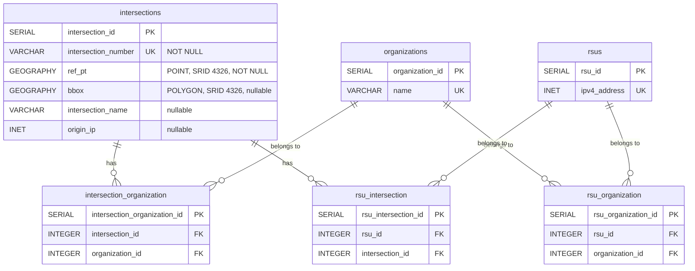
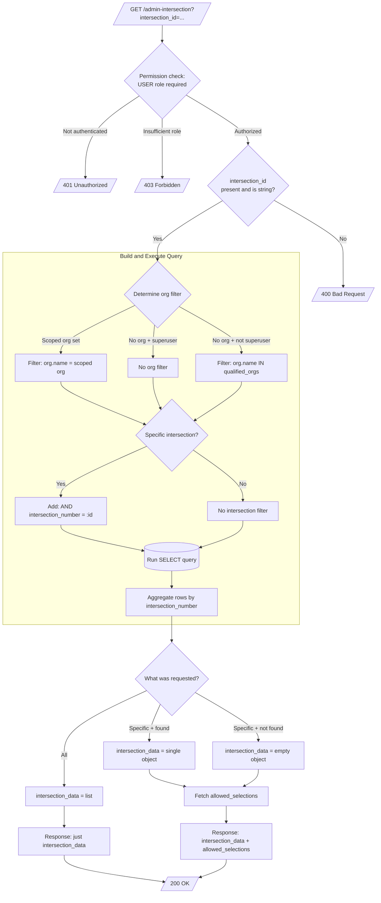
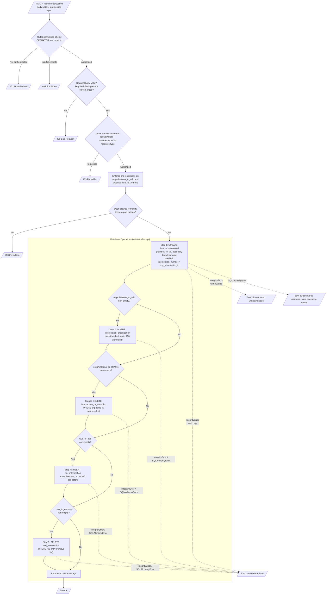
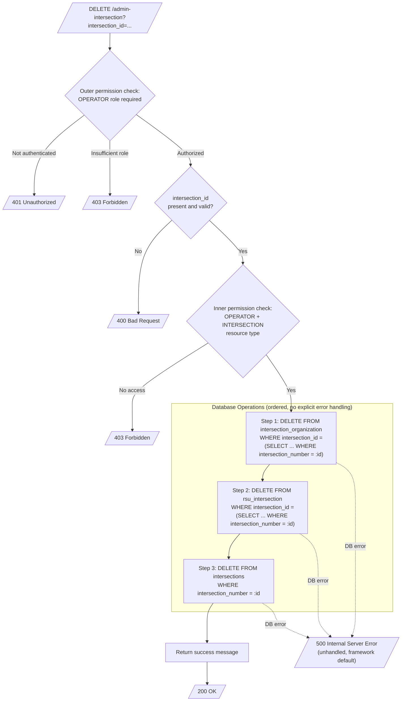

# AdminIntersection Migration Specification

This document describes the behavior of the `AdminIntersection` REST resource at `/admin-intersection`. It covers what the API does, how authorization works, the data models involved, and the exact
behavior of each endpoint. Use this document to guide re-implementation in a different framework.

Every behavior, edge case, and invariant documented here must be replicated in the new implementation unless explicitly noted as a "Known Issue to Fix."

## Table of Contents

- [Overview](#overview)
- [Feature Flag](#feature-flag)
- [Database Tables](#database-tables)
- [Authorization](#authorization)
- [CORS](#cors)
- [Endpoints](#endpoints)
    - [OPTIONS](#options)
    - [GET](#get-admin-intersection)
    - [PATCH](#patch-admin-intersection)
    - [DELETE](#delete-admin-intersection)
- [Allowed Selections](#allowed-selections)
- [Known Issues to Fix](#known-issues-to-fix)

---

## Overview

This API manages traffic intersections in the CV Manager system. An intersection has a numeric ID, a geographic reference point, an optional bounding box, an optional name, an optional origin IP
address, and relationships to organizations and RSUs (Roadside Units).

The API supports four operations:

| Method  | Role Required | What It Does                                  |
|---------|---------------|-----------------------------------------------|
| OPTIONS | None          | Returns CORS preflight headers                |
| GET     | USER          | Reads one intersection or all intersections   |
| PATCH   | OPERATOR      | Updates an intersection and its relationships |
| DELETE  | OPERATOR      | Removes an intersection and its relationships |

---

## Feature Flag

This resource is only registered when `ENABLE_INTERSECTION_FEATURES` is `True`. When the flag is off, the `/admin-intersection` route does not exist.

---

## Database Tables

Three tables are directly written by this API. Two additional lookup tables (`organizations` and `rsus`) are read but never written. A sixth table (`rsu_organization`) is used only when building
the [Allowed Selections](#allowed-selections) response for non-superusers.

All foreign keys use `ON DELETE NO ACTION`. The application must delete relationship rows before deleting an intersection.



---

## Authorization

### User Context

Authentication is handled by WSGI middleware that runs before any endpoint code. The middleware reads a Keycloak token from the `Authorization` header, introspects it, and places a user context object
into the WSGI environment. Endpoints access this as `request.environ["user"]`.

The user context contains:

| Field                     | Type                          | Description                                              |
|---------------------------|-------------------------------|----------------------------------------------------------|
| `user_info.email`         | `str`                         | The user's email address                                 |
| `user_info.super_user`    | `bool`                        | Whether the user has cross-organization access           |
| `user_info.organizations` | `dict[str, ORG_ROLE_LITERAL]` | Map of organization name to the user's role in that org  |
| `organization`            | `str` or `None`               | Organization scoped by the `Organization` request header |
| `role`                    | `ORG_ROLE_LITERAL` or `None`  | The user's role in the scoped organization               |

### Role Hierarchy

```
USER < OPERATOR < ADMIN
```

A user with OPERATOR role satisfies a USER requirement. A user with ADMIN role satisfies both. Superusers bypass org-scoped role checks and resource-level access checks entirely.

### Permission Checking

All endpoints (except OPTIONS) use the `@require_permission` decorator. The decorator runs **before** the endpoint function body, so authentication and role checks always happen before request body or
query parameter validation.

The decorator:

1. Extracts the user from `request.environ["user"]`.
2. Verifies the user is authenticated (has `user_info`). Returns **401** if not.
3. Checks the user's role meets the `required_role` threshold. Returns **403** if not. Superusers pass this check automatically.
4. Optionally checks the user has access to a specific resource (by type and ID). Returns **403** if not. Superusers skip this check.
5. Produces a `PermissionResult` containing the `user`, a `qualified_orgs` list (the organizations where the user holds the required role or higher), and an `allowed` flag.

### Double Permission Checking on PATCH and DELETE

PATCH and DELETE use two layers of permission checks (defense-in-depth):

1. **Outer check** (on the HTTP method handler): Verifies the user has OPERATOR role. No resource-type check.
2. **Inner check** (on the business logic function): Verifies the user has OPERATOR role AND has access to the specific intersection via the INTERSECTION resource type.

Both checks must pass. The new implementation must preserve this two-layer pattern.

### Organization Restriction Enforcement (PATCH only)

After permission checks pass, PATCH enforces that the user is allowed to modify the specific organizations listed in `organizations_to_add` and `organizations_to_remove`. For non-superusers, each
organization in those lists must appear in the user's `qualified_orgs`. If any organization is not in the user's qualified list, the request is rejected with **403**.

Superusers skip this check.

---

## CORS

### Preflight Headers (OPTIONS response)

| Header                         | Value                                       |
|--------------------------------|---------------------------------------------|
| `Access-Control-Allow-Origin`  | Value of `CORS_DOMAIN` environment variable |
| `Access-Control-Allow-Headers` | `Content-Type,Authorization,Organization`   |
| `Access-Control-Allow-Methods` | `GET,PATCH,DELETE`                          |
| `Access-Control-Max-Age`       | `3600`                                      |

### Standard Response Headers (all other responses)

| Header                        | Value                                       |
|-------------------------------|---------------------------------------------|
| `Access-Control-Allow-Origin` | Value of `CORS_DOMAIN` environment variable |
| `Content-Type`                | `application/json`                          |

---

## Endpoints

### OPTIONS

Returns `204 No Content` with CORS preflight headers. No authentication required.

---

### GET /admin-intersection

Retrieves intersection data. Can return a single intersection or all intersections. For single-intersection requests, also returns allowed selections (available organizations and RSUs) for use in UI
dropdowns.

#### Query Parameters

| Parameter         | Type   | Required | Values                                                           |
|-------------------|--------|----------|------------------------------------------------------------------|
| `intersection_id` | string | Yes      | `"all"` for all intersections, or a specific intersection number |

#### Authorization

Requires USER role. Authorization is checked before query parameter validation.

#### Organization Filtering

The results are filtered based on who is asking:

| User Type                      | What They See                                          |
|--------------------------------|--------------------------------------------------------|
| Has a scoped organization      | Only intersections belonging to that org               |
| No scoped org, is a superuser  | All intersections (no filter)                          |
| No scoped org, not a superuser | Intersections belonging to any of their qualified orgs |

#### Row Aggregation

The database query joins intersections with organizations and RSUs, which produces multiple rows when an intersection belongs to multiple orgs or has multiple RSUs. The API aggregates these into a
single object per intersection:

- Groups rows by `intersection_number`
- Collects distinct `org_name` values into an `organizations` list
- Collects distinct non-null `rsu_ip` values into an `rsus` list

#### Response Shape

The response shape depends on what was requested and what was found:

**Single intersection, found** — returns `intersection_data` as an object, plus `allowed_selections`:

```json
{
  "intersection_data": {
    "intersection_id": "1123",
    "ref_pt": {
      "latitude": 40.1,
      "longitude": -105.1
    },
    "bbox": {
      "latitude1": 40.0,
      "longitude1": -105.2,
      "latitude2": 40.2,
      "longitude2": -105.0
    },
    "intersection_name": "Main St & 1st Ave",
    "origin_ip": "10.0.0.1",
    "organizations": [
      "Org A"
    ],
    "rsus": [
      "192.168.1.1"
    ]
  },
  "allowed_selections": {
    "organizations": [
      "Org A",
      "Org B"
    ],
    "rsus": [
      "192.168.1.1",
      "192.168.1.2"
    ]
  }
}
```

**Single intersection, not found** — returns empty `intersection_data` object, plus `allowed_selections`:

```json
{
  "intersection_data": {},
  "allowed_selections": {
    "organizations": [
      "Org A"
    ],
    "rsus": [
      "192.168.1.1"
    ]
  }
}
```

**All intersections** — returns `intersection_data` as a list (may be empty). No `allowed_selections`:

```json
{
  "intersection_data": [
    {
      "intersection_id": "1123",
      "ref_pt": {
        "latitude": 40.1,
        "longitude": -105.1
      },
      "bbox": {
        "latitude1": 40.0,
        "longitude1": -105.2,
        "latitude2": 40.2,
        "longitude2": -105.0
      },
      "intersection_name": "Main St & 1st Ave",
      "origin_ip": "10.0.0.1",
      "organizations": [
        "Org A"
      ],
      "rsus": [
        "192.168.1.1"
      ]
    }
  ]
}
```

#### Data Flow



---

### PATCH /admin-intersection

Updates an existing intersection's properties and modifies its organization and RSU relationships. This is a complex operation that performs up to five sequential database writes.

#### Request Body

| Field                     | Type     | Required | Description                                               |
|---------------------------|----------|----------|-----------------------------------------------------------|
| `orig_intersection_id`    | integer  | Yes      | Current intersection number (identifies the record)       |
| `intersection_id`         | integer  | Yes      | New intersection number (may equal orig)                  |
| `ref_pt`                  | object   | Yes      | `{latitude: decimal, longitude: decimal}`                 |
| `bbox`                    | object   | No       | `{latitude1, longitude1, latitude2, longitude2: decimal}` |
| `intersection_name`       | string   | No       | Human-readable name                                       |
| `origin_ip`               | IPv4     | No       | Origin IP address                                         |
| `organizations_to_add`    | string[] | Yes      | Organization names to associate                           |
| `organizations_to_remove` | string[] | Yes      | Organization names to disassociate                        |
| `rsus_to_add`             | string[] | Yes      | RSU IPv4 addresses to associate                           |
| `rsus_to_remove`          | string[] | Yes      | RSU IPv4 addresses to disassociate                        |

#### Authorization

Authorization is checked before request body validation.

1. **Outer check**: OPERATOR role required.
2. **Inner check**: OPERATOR role + INTERSECTION resource type (verifies user has access to this specific intersection).
3. **Org enforcement**: Each organization in `organizations_to_add` and `organizations_to_remove` must be in the user's `qualified_orgs`. Superusers skip this check.

#### Database Operations

The PATCH performs up to five database writes in sequence. Only fields present in the request body are included in the UPDATE statement.



#### Conditional Field Updates

The UPDATE query is built dynamically. Only fields present in the request body are included:

| Field                 | Included When                            | SQL Operation                   |
|-----------------------|------------------------------------------|---------------------------------|
| `intersection_number` | Always                                   | `SET intersection_number = :id` |
| `ref_pt`              | Always                                   | `ref_pt = ST_GeomFromText(...)` |
| `bbox`                | `"bbox"` is in request body              | `bbox = ST_MakeEnvelope(...)`   |
| `intersection_name`   | `"intersection_name"` is in request body | `intersection_name = :name`     |
| `origin_ip`           | `"origin_ip"` is in request body         | `origin_ip = :ip`               |

The WHERE clause uses `orig_intersection_id` to locate the existing record. This allows the intersection number to be changed: `intersection_id` sets the new number, `orig_intersection_id` identifies
which record to update.

#### Relationship Modifications

- **Adding orgs/RSUs**: Inserts rows into `intersection_organization` or `rsu_intersection`. Each row uses subqueries to resolve the surrogate key from the business identifier (org name or RSU IP).
  Inserts are batched (up to 100 rows per statement).
- **Removing orgs/RSUs**: Deletes rows using `DELETE ... WHERE ... IN (...)` with individually named parameters (e.g. `:org_name_0`, `:org_name_1`).

#### Success Response

```json
{
  "message": "Intersection successfully modified"
}
```

#### Error Handling

All five database operations are wrapped in a single try/except block:

| Error Type                         | Response                                               |
|------------------------------------|--------------------------------------------------------|
| `IntegrityError` with error detail | 500 with parsed error message from the DB driver       |
| `IntegrityError` without detail    | 500 with `"Encountered unknown issue"`                 |
| `SQLAlchemyError`                  | 500 with `"Encountered unknown issue executing query"` |

---

### DELETE /admin-intersection

Removes an intersection and all its relationship records.

#### Query Parameters

| Parameter         | Type   | Required | Description                       |
|-------------------|--------|----------|-----------------------------------|
| `intersection_id` | string | Yes      | The intersection number to delete |

#### Authorization

Authorization is checked before query parameter validation.

1. **Outer check**: OPERATOR role required.
2. **Inner check**: OPERATOR role + INTERSECTION resource type (verifies user has access to this specific intersection).

#### Database Operations

Deletes must happen in this order because foreign keys use `ON DELETE NO ACTION`. The delete function has no explicit error handling; database errors propagate as unhandled exceptions and produce a
framework-level **500 Internal Server Error**.



#### Success Response

```json
{
  "message": "Intersection successfully deleted"
}
```

---

## Allowed Selections

When a specific intersection is requested via GET, the response includes `allowed_selections`. This provides the lists of organizations and RSUs that the user is allowed to assign to an intersection.
The UI uses this to populate dropdowns.

| User Type     | Organizations Returned                          | RSUs Returned                                                       |
|---------------|-------------------------------------------------|---------------------------------------------------------------------|
| Superuser     | All orgs from the database (sorted by name)     | All RSU IPs from the database (sorted by IP)                        |
| Non-superuser | Orgs where the user has OPERATOR role or higher | RSUs associated with those orgs (via `rsu_organization` table join) |

`allowed_selections` is **not** included when requesting all intersections (`intersection_id = "all"`).

---

## Known Issues to Fix

These are behaviors in the current implementation that should be corrected during migration.

### 1. No Transaction Boundaries

PATCH performs up to 5 independent database writes, each committed separately. DELETE performs 3. A failure partway through any operation leaves the database in a partially modified state. The new
implementation should wrap each endpoint's writes in a single database transaction.

### 2. Silent No-Op on Deleting a Nonexistent Intersection

DELETE returns `200` with a success message even when the intersection does not exist (the DELETEs affect zero rows). The new implementation should return `404` if the intersection is not found.

### 3. Fragile IntegrityError Parsing

The PATCH error handler accesses `e.orig.args[0]["D"]` to extract the database error detail, then performs string replacements (`(` to `"`, `)` to `"`, `=` to ` = `) before returning the message in a
500 response. This assumes a specific error format from the pg8000 driver and will break with driver changes. The new implementation should return structured error information instead.

### 4. DELETE Has No Explicit Error Handling

Unlike PATCH (which has a try/except with specific error messages), DELETE has no error handling at all. Database errors propagate as unhandled exceptions and produce a generic framework-level 500.
The new implementation should handle database errors explicitly in DELETE, consistent with PATCH.
