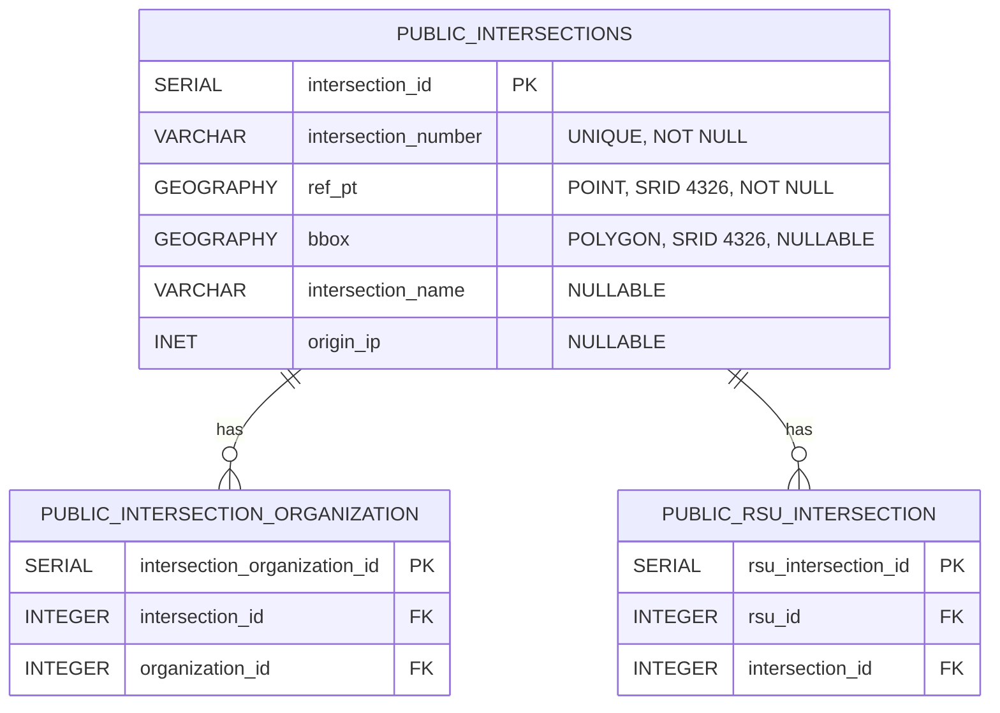
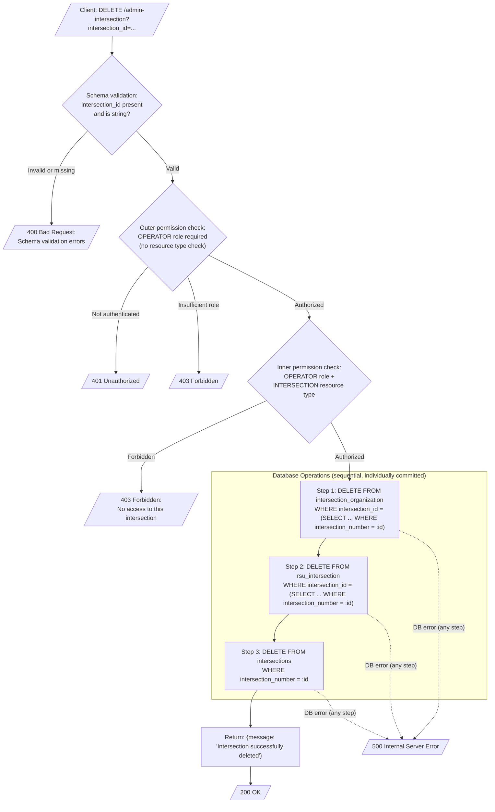

```mermaid
flowchart TD
    request_received[/"Client: GET /admin-intersection?intersection_id=..."/]
    request_received --> validate_intersection_id_present{Schema validation:<br/>intersection_id present and is string?}
    validate_intersection_id_present -->|Invalid or missing| return_400_schema[/"400 Bad Request:<br/>Schema validation errors"/]
    validate_intersection_id_present -->|Valid| check_if_specific_intersection{intersection_id != 'all'?}
    check_if_specific_intersection -->|Yes: specific ID| validate_specific_id{Additional schema validation<br/>on intersection_id}
    check_if_specific_intersection -->|No: 'all'| permission_check_user
    validate_specific_id -->|Invalid| return_400_schema
    validate_specific_id -->|Valid| permission_check_user
    permission_check_user{Permission check:<br/>USER role required}
    permission_check_user -->|Not authenticated| return_401[/"401 Unauthorized"/]
    permission_check_user -->|Insufficient role| return_403[/"403 Forbidden"/]
    permission_check_user -->|Authorized| determine_org_filter

    subgraph get_intersection_data ["get_intersection_data()"]
        determine_org_filter{Determine org filter}
        determine_org_filter -->|user . organization is set| filter_by_user_org["WHERE org.name = user.organization"]
        determine_org_filter -->|No org + super_user| no_org_filter["No org filter applied"]
        determine_org_filter -->|No org + NOT super_user| filter_by_qualified_orgs["WHERE org.name IN (qualified_orgs)"]
        filter_by_user_org --> check_specific_filter
        no_org_filter --> check_specific_filter
        filter_by_qualified_orgs --> check_specific_filter
        check_specific_filter{intersection_id != 'all'?}
        check_specific_filter -->|Yes| add_intersection_filter["Add: AND intersection_number = :id"]
        check_specific_filter -->|No| execute_query
        add_intersection_filter --> execute_query
        execute_query[("Execute SELECT query<br/>against PostgreSQL")]
        execute_query --> aggregate_rows["Aggregate rows by intersection_number:<br/>- Deduplicate organizations into list<br/>- Deduplicate non-null RSU IPs into list"]
        aggregate_rows --> check_result_set{Evaluate result set}
        check_result_set -->|" 'all' requested "| return_list["Return: list of intersection objects<br/>(may be empty list)"]
        check_result_set -->|" Specific ID + no results "| return_empty_dict["Return: empty dict {}"]
        check_result_set -->|" Specific ID + found "| return_single_object["Return: single intersection object"]
    end

    subgraph build_response ["Build Response"]
        return_list --> wrap_intersection_data_list["intersection_data = list"]
        return_empty_dict --> wrap_intersection_data_empty["intersection_data = {}"]
        return_single_object --> wrap_intersection_data_single["intersection_data = object"]
        wrap_intersection_data_list --> check_need_selections_list{intersection_id == 'all'?}
        wrap_intersection_data_empty --> check_need_selections_empty{intersection_id == 'all'?}
        wrap_intersection_data_single --> check_need_selections_single{intersection_id == 'all'?}
        check_need_selections_list -->|" Yes "| return_without_selections["Response: {intersection_data}"]
        check_need_selections_empty -->|" No "| fetch_allowed_selections
        check_need_selections_single -->|" No "| fetch_allowed_selections
    end

    subgraph get_allowed_selections ["get_allowed_selections()"]
        fetch_allowed_selections{User is super_user?}
        fetch_allowed_selections -->|Yes| query_all_orgs_rsus[("Query ALL organizations (sorted)<br/>Query ALL RSU IPs (sorted)")]
        fetch_allowed_selections -->|No| query_scoped_orgs_rsus["Get orgs where user has OPERATOR+ role<br/>Get RSUs associated with those orgs"]
        query_all_orgs_rsus --> return_with_selections["Response: {intersection_data, allowed_selections}"]
        query_scoped_orgs_rsus --> return_with_selections
    end

    return_without_selections --> return_200[/"200 OK + JSON body"/]
    return_with_selections --> return_200
```

# AdminIntersection API Specification

This document describes the behavior of the `AdminIntersection` REST resource (`/admin-intersection`) as implemented in `services/api/src/admin_intersection.py`. It is intended as a migration
reference: every behavior, edge case, and invariant documented here must be replicated in the new implementation unless explicitly noted otherwise.

## Table of Contents

- [Overview](#overview)
- [Database Schema](#database-schema)
- [Authentication and Authorization Model](#authentication-and-authorization-model)
- [Request and Response Data Models](#request-and-response-data-models)
- [Endpoint: OPTIONS](#endpoint-options)
- [Endpoint: GET /admin-intersection](#endpoint-get-admin-intersection)
- [Endpoint: PATCH /admin-intersection](#endpoint-patch-admin-intersection)
- [Endpoint: DELETE /admin-intersection](#endpoint-delete-admin-intersection)
- [Shared Behavioral Requirements](#shared-behavioral-requirements)
- [Known Issues](#known-issues)

---

## Overview

The `AdminIntersection` resource provides CRUD operations (read, update, delete) for traffic intersections in the CV Manager system. Intersections are geographic entities identified by an
`intersection_number`, with associated geospatial data (`ref_pt`, `bbox`), metadata (`intersection_name`, `origin_ip`), and relationships to organizations and RSUs (Roadside Units).

The resource is registered at `/admin-intersection` and is conditionally enabled via the `ENABLE_INTERSECTION_FEATURES` feature flag in `main.py`.

### Responsibilities

| Operation      | HTTP Method | Role Required | Description                                                 |
|----------------|-------------|---------------|-------------------------------------------------------------|
| Read           | GET         | USER          | Retrieve one or all intersections with org/RSU associations |
| Update         | PATCH       | OPERATOR      | Modify intersection properties and org/RSU relationships    |
| Delete         | DELETE      | OPERATOR      | Remove an intersection and all its relationships            |
| CORS preflight | OPTIONS     | None          | Return CORS headers                                         |

---

## Database Schema

Three tables are involved. Foreign key constraints enforce referential integrity.



Additionally, referenced (read-only by this resource):

- `public.organizations` — `organization_id`, `name`
- `public.rsus` — `rsu_id`, `ipv4_address`

---

## Authentication and Authorization Model

All endpoints (except OPTIONS) require an authenticated user. Authentication is handled by WSGI middleware that injects an `EnvironWithOrg` object into `request.environ["user"]`.

### User Context (`EnvironWithOrg`)

| Field                     | Type                          | Description                                      |
|---------------------------|-------------------------------|--------------------------------------------------|
| `user_info.email`         | `str`                         | User's email address                             |
| `user_info.super_user`    | `bool`                        | Whether the user has cross-org super user access |
| `user_info.organizations` | `dict[str, ORG_ROLE_LITERAL]` | Map of org name to user's role in that org       |
| `organization`            | `str \| None`                 | The org scoped in the request header (if any)    |
| `role`                    | `ORG_ROLE_LITERAL \| None`    | The user's role in the scoped org                |

### Role Hierarchy

```
USER < OPERATOR < ADMIN
```

A user with OPERATOR role implicitly satisfies USER requirements. Superusers bypass org-scoped restrictions.

### Permission Checking

Permission checking uses the `@require_permission` decorator, which:

1. Extracts the user from `request.environ["user"]`
2. Verifies the user is authenticated (has `user_info`)
3. Checks the user's role meets the `required_role` threshold
4. Optionally verifies access to a specific resource type and ID
5. Returns a `PermissionResult` with `user`, `qualified_orgs`, and `allowed` status

**PATCH and DELETE use intentional double permission checking:**

- The REST endpoint method checks role only (`OPERATOR`)
- The inner authorized function checks role + resource type (`OPERATOR` + `INTERSECTION`)

This is defense-in-depth and must be preserved.

---

## Request and Response Data Models

### GET Query Parameters

| Parameter         | Type     | Required | Description                                      |
|-------------------|----------|----------|--------------------------------------------------|
| `intersection_id` | `string` | Yes      | Either `"all"` or a specific intersection number |

### GET Response — Single Intersection

When `intersection_id` is a specific value and found:

```json
{
  "intersection_data": {
    "intersection_id": "1123",
    "ref_pt": {
      "latitude": 40.1,
      "longitude": 41.1
    },
    "bbox": {
      "latitude1": 42.1,
      "longitude1": 43.1,
      "latitude2": 44.1,
      "longitude2": 45.1
    },
    "intersection_name": "Test intersection",
    "origin_ip": "10.0.0.1",
    "organizations": [
      "org_a"
    ],
    "rsus": [
      "1.1.1.1"
    ]
  },
  "allowed_selections": {
    "organizations": [
      "Org A",
      "Org B"
    ],
    "rsus": [
      "192.168.1.1",
      "192.168.1.2"
    ]
  }
}
```

### GET Response — All Intersections

When `intersection_id` is `"all"`:

```json
{
  "intersection_data": [
    {
      "intersection_id": "1123",
      "ref_pt": {
        "latitude": 40.1,
        "longitude": 41.1
      },
      "bbox": {
        "latitude1": 42.1,
        "longitude1": 43.1,
        "latitude2": 44.1,
        "longitude2": 45.1
      },
      "intersection_name": "Test intersection",
      "origin_ip": "10.0.0.1",
      "organizations": [
        "org_a"
      ],
      "rsus": [
        "1.1.1.1"
      ]
    }
  ]
}
```

Note: `allowed_selections` is **not** included when requesting all intersections.

### GET Response — Not Found

When `intersection_id` is a specific value but not found:

```json
{
  "intersection_data": {},
  "allowed_selections": {
    "organizations": [
      "Org A"
    ],
    "rsus": [
      "192.168.1.1"
    ]
  }
}
```

### PATCH Request Body

| Field                     | Type                                                      | Required | Description                                            |
|---------------------------|-----------------------------------------------------------|----------|--------------------------------------------------------|
| `orig_intersection_id`    | `integer`                                                 | Yes      | The current intersection number (used in WHERE clause) |
| `intersection_id`         | `integer`                                                 | Yes      | The new intersection number (may be same as orig)      |
| `ref_pt`                  | `{latitude: decimal, longitude: decimal}`                 | Yes      | Reference point coordinates                            |
| `bbox`                    | `{latitude1, longitude1, latitude2, longitude2: decimal}` | No       | Bounding box envelope                                  |
| `intersection_name`       | `string`                                                  | No       | Human-readable name                                    |
| `origin_ip`               | `IPv4`                                                    | No       | Origin IP address                                      |
| `organizations_to_add`    | `string[]`                                                | Yes      | Org names to associate                                 |
| `organizations_to_remove` | `string[]`                                                | Yes      | Org names to disassociate                              |
| `rsus_to_add`             | `string[]`                                                | Yes      | RSU IPv4 addresses to associate                        |
| `rsus_to_remove`          | `string[]`                                                | Yes      | RSU IPv4 addresses to disassociate                     |

### PATCH / DELETE Success Response

```json
{
  "message": "Intersection successfully modified"
}
```

```json
{
  "message": "Intersection successfully deleted"
}
```

---

## Endpoint: OPTIONS

**Purpose:** CORS preflight support.

**Response:** `204 No Content` with headers:

| Header                         | Value                                     |
|--------------------------------|-------------------------------------------|
| `Access-Control-Allow-Origin`  | `CORS_DOMAIN` (from environment)          |
| `Access-Control-Allow-Headers` | `Content-Type,Authorization,Organization` |
| `Access-Control-Allow-Methods` | `GET,PATCH,DELETE`                        |
| `Access-Control-Max-Age`       | `3600`                                    |

---

## Endpoint: GET /admin-intersection

### Behavior Summary

Retrieves intersection data for a single intersection or all intersections. For single-intersection requests, also returns allowed selections (available organizations and RSUs) that the user may
assign.

### Organization Filtering Logic

The query results are filtered based on the user's organizational context:

| Condition                                                    | Filter Applied                   |
|--------------------------------------------------------------|----------------------------------|
| `user.organization` is set                                   | `org.name = <user's org>`        |
| `user.organization` is `None` AND user is **not** super_user | `org.name IN (<qualified_orgs>)` |
| `user.organization` is `None` AND user **is** super_user     | No org filter (sees all)         |

### Row Aggregation

The SQL query JOINs intersections with organizations and RSUs, producing multiple rows per intersection when an intersection has multiple org or RSU associations. The code aggregates these rows:

- Groups by `intersection_number`
- Collects unique `org_name` values into an `organizations` list
- Collects unique non-null `rsu_ip` values into an `rsus` list

### Return Value Rules

| Condition                                | Return Type           |
|------------------------------------------|-----------------------|
| `intersection_id == "all"`               | `list` (may be empty) |
| Single intersection requested, found     | Single `dict` object  |
| Single intersection requested, not found | Empty `dict` `{}`     |

### Allowed Selections (Single Intersection Only)

When a specific `intersection_id` is requested, the response includes `allowed_selections`:

| User Type      | Organizations Returned             | RSUs Returned                   |
|----------------|------------------------------------|---------------------------------|
| Super user     | All orgs from DB (sorted by name)  | All RSU IPs from DB (sorted)    |
| Non-super user | Orgs where user has OPERATOR+ role | RSUs associated with those orgs |

### Data Flow Diagram



---

## Endpoint: PATCH /admin-intersection

### Behavior Summary

Modifies an existing intersection's properties and updates its organization and RSU relationships. This is a complex operation that performs up to five sequential database writes within error
handling.

### Operation Sequence

1. **Update intersection record** — Always executes. Updates `intersection_number`, `ref_pt`, and conditionally updates `bbox`, `intersection_name`, `origin_ip` if present in the request body.
2. **Add organization relationships** — Only if `organizations_to_add` is non-empty. Uses batched INSERT.
3. **Remove organization relationships** — Only if `organizations_to_remove` is non-empty. Uses DELETE with IN clause.
4. **Add RSU relationships** — Only if `rsus_to_add` is non-empty. Uses batched INSERT.
5. **Remove RSU relationships** — Only if `rsus_to_remove` is non-empty. Uses DELETE with IN clause.

### Conditional Field Updates

The UPDATE query is built dynamically. Only fields present in the request body are included:

| Field                 | Condition                     | SQL Fragment                               |
|-----------------------|-------------------------------|--------------------------------------------|
| `intersection_number` | Always                        | `SET intersection_number=:intersection_id` |
| `ref_pt`              | Always                        | `ref_pt=ST_GeomFromText(...)`              |
| `bbox`                | `"bbox" in spec`              | `bbox=ST_MakeEnvelope(...)`                |
| `intersection_name`   | `"intersection_name" in spec` | `intersection_name=:intersection_name`     |
| `origin_ip`           | `"origin_ip" in spec`         | `origin_ip=:origin_ip`                     |

The WHERE clause uses `orig_intersection_id` to locate the existing record, allowing the intersection number to be changed.

### Error Handling

| Exception Type                  | Behavior                                                                                                                     |
|---------------------------------|------------------------------------------------------------------------------------------------------------------------------|
| `IntegrityError` with `orig`    | Parse error detail from `e.orig.args[0]["D"]`, replace parens with quotes and `=` with ` = `, return 500 with parsed message |
| `IntegrityError` without `orig` | Return 500 with generic "Encountered unknown issue"                                                                          |
| `SQLAlchemyError`               | Log error, return 500 with "Encountered unknown issue executing query"                                                       |

### Input Safety Check

Before any database operations, `check_safe_input()` validates the request body. See [Shared Behavioral Requirements](#shared-behavioral-requirements) for details. If validation fails, returns
`400 Bad Request`.

**Migration note:** The new implementation should use parameterized queries exclusively and may omit the `check_safe_input` character blocklist, as parameterized queries prevent SQL injection.

### Data Flow Diagram

```mermaid
flowchart TD
    request_received[/"Client: PATCH /admin-intersection<br/>Body: JSON intersection spec"/]
    request_received --> validate_schema{Schema validation:<br/>required fields present?<br/>correct types?}
    validate_schema -->|" Invalid (e.g. non-decimal coords,<br/>missing required fields) "| return_400_schema[/"400 Bad Request:<br/>Schema validation errors"/]
    validate_schema -->|Valid| outer_permission_check
    outer_permission_check{"Outer permission check:<br/>OPERATOR role required<br/>(no resource type check)"}
    outer_permission_check -->|Not authenticated| return_401[/"401 Unauthorized"/]
    outer_permission_check -->|Insufficient role| return_403_outer[/"403 Forbidden"/]
    outer_permission_check -->|Authorized| inner_permission_check
    inner_permission_check{"Inner permission check:<br/>OPERATOR role +<br/>INTERSECTION resource type"}
    inner_permission_check -->|Forbidden| return_403_inner[/"403 Forbidden:<br/>No access to this intersection"/]
    inner_permission_check -->|Authorized| org_enforcement
    org_enforcement["enforce_organization_restrictions()<br/>(checks organizations_to_add,<br/>organizations_to_remove)"]
    org_enforcement --> safe_input_check
    safe_input_check{check_safe_input:<br/>special characters in input?}
    safe_input_check -->|" Unsafe characters found "| return_400_unsafe[/"400 Bad Request:<br/>No special characters allowed"/]
    safe_input_check -->|Safe| begin_db_operations

    subgraph db_operations ["Database Operations (within try/except)"]
        begin_db_operations["Step 1: UPDATE intersection record"]
        begin_db_operations --> update_intersection[("UPDATE public.intersections<br/>SET intersection_number, ref_pt<br/>+ conditional: bbox, name, origin_ip<br/>WHERE intersection_number = orig_id")]
        update_intersection --> check_orgs_to_add{organizations_to_add<br/>is non-empty?}
        check_orgs_to_add -->|Yes| insert_org_relationships["Step 2: INSERT intersection_organization<br/>rows (batched, up to 100 per batch)"]
        check_orgs_to_add -->|No / empty list| check_orgs_to_remove
        insert_org_relationships --> check_orgs_to_remove{organizations_to_remove<br/>is non-empty?}
        check_orgs_to_remove -->|Yes| delete_org_relationships["Step 3: DELETE intersection_organization<br/>WHERE org name IN (remove list)"]
        check_orgs_to_remove -->|No / empty list| check_rsus_to_add
        delete_org_relationships --> check_rsus_to_add{rsus_to_add<br/>is non-empty?}
        check_rsus_to_add -->|Yes| insert_rsu_relationships["Step 4: INSERT rsu_intersection<br/>rows (batched, up to 100 per batch)"]
        check_rsus_to_add -->|No / empty list| check_rsus_to_remove
        insert_rsu_relationships --> check_rsus_to_remove{rsus_to_remove<br/>is non-empty?}
        check_rsus_to_remove -->|Yes| delete_rsu_relationships["Step 5: DELETE rsu_intersection<br/>WHERE rsu IP IN (remove list)"]
        check_rsus_to_remove -->|No / empty list| return_success
        delete_rsu_relationships --> return_success
    end

    return_success["Return: {message: 'Intersection successfully modified'}"]
    return_success --> return_200[/"200 OK"/]

subgraph error_handling ["Error Handling"]
update_intersection -.->|IntegrityError<br/>with orig|handle_integrity_with_orig["Parse e.orig.args[0]['D']<br/>Replace '(' with '\"', ')' with '\"'<br/>Replace '=' with ' = '"]
handle_integrity_with_orig --> return_500_parsed[/"500 Internal Server Error:<br/>parsed error message"/]

update_intersection -.->|IntegrityError<br/>without orig|return_500_unknown_integrity[/"500 Internal Server Error:<br/>'Encountered unknown issue'"/]

update_intersection -.->|SQLAlchemyError|return_500_generic[/"500 Internal Server Error:<br/>'Encountered unknown issue executing query'"/]

insert_org_relationships -.->|IntegrityError / SQLAlchemyError|handle_integrity_with_orig
delete_org_relationships -.->|IntegrityError / SQLAlchemyError|handle_integrity_with_orig
insert_rsu_relationships -.->|IntegrityError / SQLAlchemyError|handle_integrity_with_orig
delete_rsu_relationships -.->|IntegrityError / SQLAlchemyError|handle_integrity_with_orig
end
```

### Important Implementation Details

1. **Batched inserts for org and RSU adds**: Organization and RSU relationship inserts use `write_db_batched()` which assembles individual `(subquery, subquery)` value tuples into a single
   `INSERT ... VALUES (...),(...),...` statement, batched at 100 rows. Each value tuple uses named parameters like `:org_name_0`, `:org_name_1`, etc.

2. **Relationship deletes use IN clauses**: Organization and RSU relationship deletes use `DELETE ... WHERE ... IN (...)` with individually named parameters (`:org_name_0`, `:rsu_ip_0`, etc.).

3. **No transaction wrapping**: The five database operations are executed as independent `write_db` calls, each committing separately. A failure partway through leaves the database in a partially
   modified state.

4. **The UPDATE uses `orig_intersection_id` for lookup**: This allows renumbering an intersection. The `intersection_id` field sets the new number; `orig_intersection_id` identifies which record to
   update.

---

## Endpoint: DELETE /admin-intersection

### Behavior Summary

Deletes an intersection and all its relationship records. The deletion is performed in a specific order to respect foreign key constraints.

### Operation Sequence

1. **Delete intersection-organization relationships** — `DELETE FROM intersection_organization WHERE intersection_id = (subquery)`
2. **Delete RSU-intersection relationships** — `DELETE FROM rsu_intersection WHERE intersection_id = (subquery)`
3. **Delete intersection record** — `DELETE FROM intersections WHERE intersection_number = :id`

### Data Flow Diagram



### Important Implementation Details

1. **Deletion order matters**: Relationship tables must be cleared before the intersection record due to foreign key constraints. The `intersection_organization` and `rsu_intersection` tables have
   `FK → intersections`.

2. **No cascading deletes**: The database schema uses `ON DELETE NO ACTION` for all foreign keys. The application must explicitly delete relationships first.

3. **No transaction wrapping**: Like PATCH, the three deletes are independent commits. A failure after step 1 but before step 3 leaves orphaned state.

4. **Intersection lookup by `intersection_number`**: The DELETE uses `intersection_number` (the business identifier) not the database `intersection_id` (the surrogate key). Subqueries resolve the
   surrogate key at execution time.

5. **No existence check**: If the intersection doesn't exist, the DELETEs silently affect zero rows and the endpoint still returns 200 success.

---

## Shared Behavioral Requirements

### Input Safety Validation (`check_safe_input`)

Defined in `admin_new_intersection.py`. Recursively validates all fields in the intersection spec for potentially unsafe characters.

**Blocked characters:** ``!"#$%'()*+,./:;<=>?@[\]^`{|}~``

**Blocked sequences:** `--` (double hyphen)

**Exempt fields** (not checked): `origin_ip`, `rsus`, `rsus_to_add`, `rsus_to_remove`, `latitude`, `longitude`, `latitude1`, `longitude1`, `latitude2`, `longitude2`

**Recursive behavior:**

- `dict` values: recurse into nested dict
- `list` values: check each element individually by wrapping in a dict
- `None` values: skip
- All other values: check `str(value)` against the blocklist

**Migration note:** This validation exists because some code paths (specifically `add_intersection` in `admin_new_intersection.py`) use string interpolation for SQL queries. The new implementation
should use parameterized queries exclusively, making this character blocklist unnecessary.

### Allowed Selections (`get_allowed_selections`)

Defined in `admin_new_intersection.py`. Returns the set of organizations and RSUs that the user is permitted to assign to an intersection. Used in the GET response for single-intersection requests to
populate dropdown options in the UI.

| User Type      | Organizations                                         | RSUs                                                          |
|----------------|-------------------------------------------------------|---------------------------------------------------------------|
| Super user     | All orgs from `public.organizations` (sorted by name) | All RSU IPs from `public.rsus` (sorted by IP)                 |
| Non-super user | Orgs where user has OPERATOR+ role                    | RSUs associated with those orgs (via `rsu_organization` join) |

### CORS Headers

All responses include:

| Header                        | Value                              |
|-------------------------------|------------------------------------|
| `Access-Control-Allow-Origin` | `CORS_DOMAIN` environment variable |
| `Content-Type`                | `application/json`                 |

---

## Known Issues

These are documented for awareness during migration. They represent current behavior that may be intentionally corrected in the new implementation.

### 1. No Transaction Boundaries

PATCH performs up to 5 independent database writes, each committed separately. DELETE performs 3. A failure partway through any operation leaves the database in a partially modified state. The new
implementation should wrap multi-step mutations in a single database transaction.

### 2. Silent No-Op on Delete of Nonexistent Intersection

DELETE returns `200 {message: "Intersection successfully deleted"}` even when the intersection doesn't exist. Consider returning `404` if no rows are affected.

### 3. IntegrityError Message Parsing is Fragile

The PATCH error handler parses `e.orig.args[0]["D"]` and performs string replacements (`(` to `"`, `)` to `"`, `=` to ` = `). This assumes a specific error format from the pg8000 driver and may break
with driver updates. Consider returning structured error information instead.
